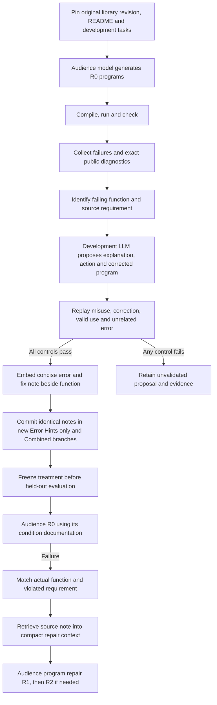

# Automatic error guidance beside library functions

AIDEAL learns a compact, testable usage note from an Original README development
run. The note is installed as a comment immediately before the related function.
The model supplies a diagnosis and proposed correction. Execution evidence decides
whether that proposal is eligible for installation.



## What is automatic

1. The development runner records the exact request, response, generated program,
   source revision, task identity, compiler/runtime output, verdict, time and token
   usage. It uses only Original documentation at R0 and performs no audience repair.
2. `preview-source-hints` accepts only an explicit Original/development/R0 manifest.
   It excludes successful programs, incomplete generations and failures whose
   function cannot be identified. Held-out task IDs cannot enter this manifest.
3. `propose-source-hints` sends the relevant failure, candidate, exact signature,
   bounded source evidence and original document context to the development LLM.
   The request and raw response remain recorded. The model must tie its diagnosis
   to supplied evidence; it cannot invent an API or certify its own proposal.
4. `validate-source-hints` checks a reproduced misuse, the proposed correction,
   valid usage and a nearby unrelated failure. The unrelated failure must not
   retrieve this hint. A failed validation leaves the proposal uninstalled.
5. `install-source-hints` rechecks the validation record, source hashes and
   annotation-only changes. It creates explicitly named new Git branches,
   installs identical source notes in both hint-enabled conditions, removes the
   legacy hint JSON only from those new branches, and records their commits.

Provider outages, incomplete responses, missing dependencies, and incorrect test
expectations are distinct from demonstrated API misuse. They should remain in the
development failure record unless a function-specific requirement and correction
are independently established. R0 cannot reveal every possible failure, so the
coverage report must show both covered and uncovered functions.

## What belongs in source and what belongs in memory

The source comment contains the failing requirement, observed diagnostic,
corrective action and validation result. For example, this is the intended shape
of a note, not a claim that this particular example has passed validation:

```scala
// AIDEAL-HINT-BEGIN
// function_id: <source-path>:<original-line>:rescale
// requirement_id: integer_dimensions
// requirement: Both raster dimensions must be Int values.
// diagnostic: required: Int
// action: Supply integer pixel dimensions; choose rounding explicitly when needed.
// validation: <development control results and evidence identifier>
// status: unvalidated
// AIDEAL-HINT-END
def rescale(newRasterWidth: Int, newRasterHeight: Int): RasterMetadata = {
  // Original implementation remains unchanged.
}
```

The full error/fix history belongs in development memory, linked by evidence ID.
It contains all attempts and unsuccessful proposals, rather than accumulating a
large transcript in the library. A derived JSON index and validation receipts are
machine records; the guidance itself is read from the committed source comments.

During the planned hint ablation, R0 receives no hint. After a failure, the evaluator
identifies the actual function and requirement, then supplies its frozen note.
Putting notes into every R0 prompt would be a different intervention. Development
memory is not exposed to held-out audience trials, and test failures do not update
the shared treatment during a frozen comparison.

## Other approaches and the recommended combination

| Approach | Benefit | Limit and role in AIDEAL |
|---|---|---|
| Compiler fix-it diagnostics | Precise source locations and machine-readable edits when the compiler knows a correction | Useful evidence for syntax/type errors; they do not explain every library contract. |
| Explicit preconditions and improved runtime exceptions | Explain invalid values at the point the library detects them | Changes executable behavior and may add overhead; study separately from comment-only hints. |
| Failure memory | Retains observations and proposed repairs across development attempts | Unverified reflections can repeat mistakes; validate and freeze any material used by evaluation. |
| Retrieval of relevant source | Supplies contextual signatures and nearby implementation | Similarity alone does not establish the failing function or violated requirement. |
| Executable documentation and regression examples | Detects when a documented correction stops working after library changes | Requires maintained fixtures and language-specific execution; complements source notes rather than replacing diagnosis. |

The recommended design combines precise diagnostic localization, a source-grounded
LLM proposal, replay controls, source-local notes and a separate development memory.
It does not treat model confidence or a plausible explanation as proof of a fix.

Clang documents machine-readable fix-its and their source ranges in its
[compiler manual](https://clang.llvm.org/docs/UsersManual.html#cmdoption-fdiagnostics-parseable-fixits).
GCC's [diagnostic guidelines](https://gcc.gnu.org/onlinedocs/gccint/Guidelines-for-Diagnostics.html)
recommend checking that a suggested fix produces compilable code.
[Reflexion](https://arxiv.org/abs/2303.11366) retains feedback-derived reflections
in episodic memory. [RepoCoder](https://aclanthology.org/2023.emnlp-main.151/)
uses iterative retrieval and generation for repository-level completion. These
are related mechanisms, not empirical validation of AIDEAL's proposed combination.
Rust [documentation tests](https://doc.rust-lang.org/rustdoc/write-documentation/documentation-tests.html)
provide a concrete example of executable source documentation, including expected
failures. AIDEAL can retain small regression programs beside its evidence records
and replay them whenever the pinned library revision changes.

## Code entry points

| Operation | Code |
|---|---|
| Evidence preparation, proposal and controls | `workflow/source_hint_development.py` |
| Annotation-only proposal files | `workflow/source_hint_proposals.py` |
| Source comment parsing and indexing | `workflow/source_hints.py` |
| Function and requirement localization | `workflow/failure_diagnosis.py` |
| Compact repair input | `workflow/repair_context.py` |
| New branch installation | `workflow/source_hint_installation.py` |
| Command routes | `workflow/development_cli.py` |

Use `python -m workflow --help` to find the four source-hint commands. All proposal,
validation and installation outputs have separate paths. Reusing a path with
changed inputs must fail, rather than silently replacing its earlier evidence.

## Current RDPro evidence (September 24, 2026)

The separate study at
`AIDEAL_WORKSPACE/03_Experiments/rdpro/2026-09-24-source-embedded-hints-r0-r2`
contains eight completed Original development R0 cases. Four failures support
function localization and four remain unresolved. The saved preview has not yet
been sent to the development author because specific source-payload approval is
pending. No real source annotations have been installed in the new branches yet.

A concrete recorded case asks the audience to read a nested type. Its generated
program calls `Feature.writeType(out, t)`, but the official declaration is
`writeType(t: DataType, out: ObjectOutput)`. The compiler reports the swapped
types. This makes `Feature.writeType` the candidate hint location, even though
`Feature.readType` is the task target. A proposed note should explain that exact
argument-order requirement. It remains a proposed correction until execution
checks pass; source analysis alone does not establish success.

The current hold applies to the full measured experiment. Historical JSON-only
results remain historical; the new comments must receive their own source and
runtime freeze before a comparison.
