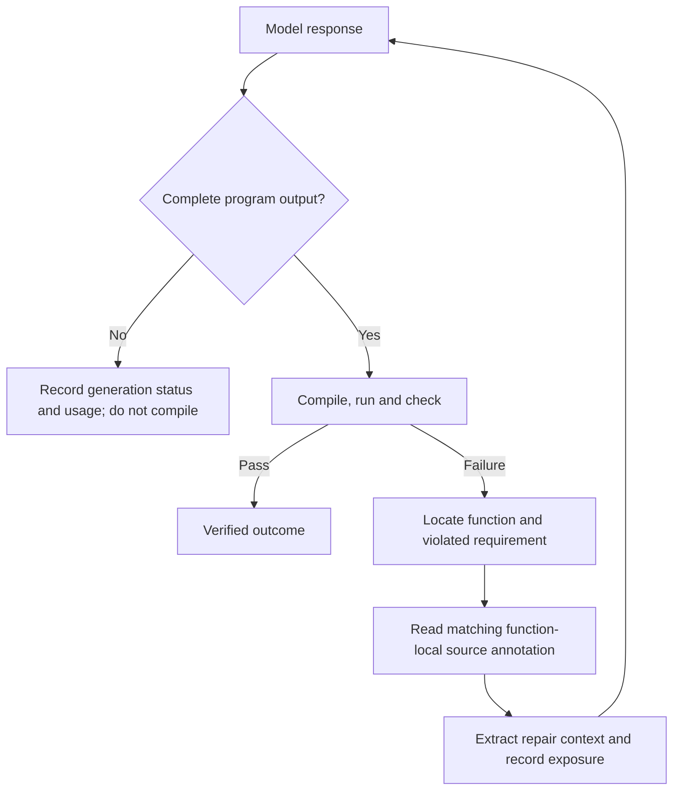

# Source-guided repair workflow

The new `condition_evaluation_source_hints_v2` protocol separates failure diagnosis,
repair context and model output completeness. Existing recorded experiments retain
their original settings and results. Freeze a **new** study after changing code,
source annotations, context selection or output allowances.

## What happens after a failure

1. Save the provider response, exact request and token usage. Classify incomplete,
   refused or empty output before compilation. Such a response stops the unit with
   a separate generation status. It is not a compiler/API failure, and no repair
   hint is inferred from it. The selected-task denominator remains unchanged.
2. For a complete candidate, compile/run/check through the configured adapter.
3. Identify the failing library function from a compiler location and verified
   call-site evidence, a qualified stack frame, or explicit public adapter
   attribution. Task targets alone are not sufficient evidence.
4. Read the function's annotation from its pinned source file. Both the function
   identity and a specific requirement diagnostic must match. Ambiguity, missing
   coverage and an unsupported diagnostic yield explicit no-match reasons.
5. Assemble the next repair request from the task, public documentation, complete
   latest candidate, unique diagnostic paragraphs, exact matched signature,
   violated requirement, corrective action and validation instruction.
6. Run the next complete candidate and retain its independent check result.
   A hint remains guidance; selection is not proof of a successful repair.



## Function-local guidance

Use readable whole-line comments immediately before the declaration. Python uses
`#`; Scala, Java and Rust use `//`. The bounded parser supports these languages,
not arbitrary source syntax or whole-program type inference. Canonical function
IDs retain their original declaration line before annotations are inserted.
For example, if the original declaration is at line 219 of `src/RasterMetadata.scala`:

```scala
// AIDEAL-HINT-BEGIN
// function_id: src/RasterMetadata.scala:219:rescale
// requirement_id: integer_dimensions
// requirement: Both requested raster dimensions must have type Int.
// diagnostic: required: Int
// action: Supply integer dimensions; do not silently round a non-integral request.
// validation: Compile and rerun the independent dimension and geometry checks.
// status: unvalidated
// AIDEAL-HINT-END
def rescale(rasterWidth: Int, rasterHeight: Int): RasterMetadata = {
  // Existing implementation remains unchanged.
}
```

The path, line and function in this illustration must be replaced with the actual
inventory identity. A generic phrase such as `type mismatch` is rejected as a
requirement trigger. A `Unit` versus `Array[Double]` error cannot select the
integer-dimensions hint merely because its task mentions `rescale`.

Prepare annotated source without modifying an existing checkout:

```bash
python -m workflow.source_hint_proposals --source-root /path/to/original/source \
  --spec /path/to/reviewed-guidance.json --output /path/to/new/development/proposal
```

The specification supplies `schema_version: 1`, `api_function_ids`, a
`source_sha256` map for every edited relative source path, and a `hints` list
with the fields shown above. It can contain reviewed model proposals or manually
written guidance. The command emits annotated source, a patch, provenance and
coverage. It makes no model calls and does not invent requirements for uncovered
functions. Existing LLM proposal generation remains a separate development
step; its older generic JSON hints are not automatically promoted into source
requirements. The JSON specification is authoring input, not the evaluation hint
store. Evaluation reads the comments in the committed source files.

Apply the reviewed patch to **new** Error Hints only and Combined branches,
commit it, rebuild the appropriate runtime if required, and configure
`source_hints: [relative/source/file.scala]` for those arms. Source-only guidance
must be identical between the two arms. The freeze rejects changes to executable
implementation in an Error Hints only arm; Combined must preserve the Alias only
implementation after removing only the recognized annotation comments. Each
backend still runs reference, wrong-output and no-target-call controls. A checker
that validates its request protocol must accept
`condition_evaluation_source_hints_v2`. The archived RDPro checker accepts only
the old protocol; copy it into the new study and update that allowlist before
freezing. Do not edit its frozen historical copy.

## Settings and coverage

Start from `configs/source_guided_evaluation.example.yaml`, replacing its paths,
revision placeholders and API mapping. It uses 8192 output tokens for initial
and repair requests. This is a starting allowance, not a guarantee that every
program will fit. Providers that count reasoning within output use part of this
same allowance. Set `repair_max_output_tokens` independently as needed; the
controller does not raise it silently or retry an incomplete response as a
transport error. Changing the allowance requires a new freeze and output path.

`repair_context: distilled` uses deterministic extraction, with no extra LLM
request. It keeps complete documentation blocks and removes exact repeated
public diagnostic paragraphs. It preserves the full latest candidate, signatures
and corrective guidance. It never slices a matched hint to meet its character
allowance. An oversized hint is reported as omitted. The complete raw context
and provider/checker logs remain in the attempt records. Shorter input does not
increase the output allowance.

`minimum_hint_coverage` ranges from 0 to 1. The example requires coverage of every
selected API. Use a lower explicit value for a deliberately partial treatment;
the frozen index lists uncovered IDs. Function coverage is not coverage of all
possible failures. Development must supply evidence for each new requirement;
held-out test answers must never become hints.

Coverage and successful backend controls do not validate the correctness of a
hint. The generic freeze checks annotation/source identities and backend controls;
it does not independently authenticate a development-validation receipt. For a
validated source-hint study, use `validate-source-hints` and
`install-source-hints` first, then bind their installed commits in the new freeze.
Manually supplied annotations can remain explicitly unvalidated and must not be
reported as validated corrective guidance.

The portable three-README runner also classifies incomplete responses and can
compact repeated repair diagnostics. Source hint retrieval and whole-block
repair-document selection belong to the new matched-condition protocol.

For a schema-2 follow-up, `measured_conditions: [error_hints_only, combined]`
restricts audience trials to those two arms. All five configured backends still
must pass reference and negative controls. Omit this field to measure the full
configured design. Reports retain the fixed denominator for each measured arm
and name the actual comparison baseline; an omitted Original arm has no new score.

`source_api_function_ids` can add helper functions to the source attribution
inventory without adding benchmark tasks. This matters when a program fails in
a helper rather than in the task's named target. Coverage records distinguish the
evaluated APIs from the larger attribution inventory. Schema 2 rejects legacy
JSON hint delivery instead of falling back to it when a source note is missing.

## Adapter attribution and evidence

An adapter can expose an optional `public_failure` containing exactly
`function_id`, `requirement_id` and `diagnostic`. All three must be nonempty
strings, and `diagnostic` must also occur in `public_feedback`. Only public,
user-observable diagnostics belong here. Expected values, hidden fixtures and
oracle details must stay private. Conflicting compiler/stack attribution blocks
automatic selection. Unsupported syntax remains unresolved rather than guessed.

Every unit retains:

- `round_XX/provider_YYY/request.json`, `process.json`, stdout and stderr for exact model input/output and usage.
- `round_XX/generation.json` for response completeness and bound provider evidence.
- `round_XX/context_exposure.json` for documentation, source-hint matching, omissions and distilled-context hashes.
- `round_XX/execution_YYY/` for complete candidates only, with checker requests and results.
- `result.json` and aggregate reports for generation failures, verified passes/failures, time and tokens.

An incomplete unit is unresolved, appears separately in reports, and is not
silently resubmitted when the same study resumes. `--retry-provider` applies to
transport failures, not output truncation. Use a new protocol to change output
capacity or context policy and compare matched tasks under the same settings.
