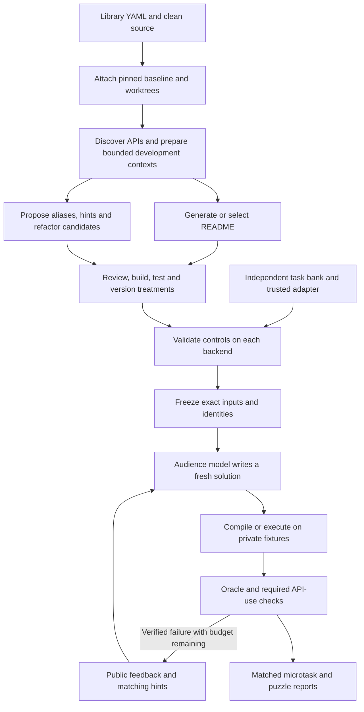

# Workflow and system design

AIDEAL separates **development** of library-facing improvements from **measurement** using fresh generated programs. Development can inspect source, original documentation, tests, project context and explicitly selected development errors. Evaluation receives frozen public tasks, selected documentation and permitted treatment context; hidden fixtures and expected outputs remain checker inputs.

## What each stage knows

| Stage | Inputs and model exposure | Output |
| --- | --- | --- |
| Attach/preview | Configured source/tests, original docs, profile, API inventory, explicit development errors | Pinned baseline, bounded batches, coverage and input hashes; no provider call |
| Native README author | API signatures, source/test evidence, original examples, distilled docs and project context | Generated catalogue; optional configured development probes |
| Alias/hint proposals | Saved batch context and bounded library overview | Recorded suggestions, alias code/interface, evidence-based hints, review-only refactor candidates |
| Source refactor | Full-file replacement/deletion manifest and compatibility plan | Separate versioned branch; no automatic equivalence claim |
| Freeze | Shared bank, every condition's docs/source/runtime, model settings, trusted controls | Validated control matrix and `frozen.json` |
| Audience solve/repair | Public task/scaffold, selected README, applicable alias interface; prior code and public feedback on repairs | Fresh candidate and exact request/exposure records |
| Trusted check | Candidate, private oracle/targets, declared condition/backend | Verified execution/oracle/reachability flags and retained evidence |
| Report | Verified condition × case × trial records | Fixed-denominator scores, paired changes, unresolved work and resources |

The library-batch path can cover selected definitions through multiple bounded requests. It reports omissions/truncation; it does not send every source file in one prompt or guarantee that every API needs a treatment. Alias names and destinations are checked before installation. Refactor suggestions require cited evidence and remain review candidates, not automatically applied patches.

## Explicit README authoring sessions

The [audited session path](README_SESSIONS.md) freezes a qualified definition manifest, immutable base and supplied context before any call. Full authoring makes one prepared entry call. Refresh makes one fresh deep-dive plus one rewrite per selected family; all non-selected bytes remain unchanged. It uses the existing native prompt loader with explicit author/reviewer/fixer contracts through the shared budgeted bridge, without legacy progress/cache reuse or execution-based acceptance. Exact phase receipts and settled ledger rows are checked before resume.

The separate three-document evaluator can compare an unchanged generated base, selected API refresh and full README refresh using an explicit `selective_refresh` design. In the prepared full-refresh recipe, full authoring runs again from the common skeleton/facts, followed by the same selected-entry refresh; it is not a refresh of every existing entry. New sessions and this comparison are prepared capabilities; actual completion requires saved provider/checker results.

## Prompts and model calls

| Purpose | Runtime prompt source | Configured role |
| --- | --- | --- |
| README distillation/entries | [readme_distill.md](../vendor/aideal_engine/src/aideal/default_prompts/aideal/readme_distill.md), [readme_entry.md](../vendor/aideal_engine/src/aideal/default_prompts/aideal/readme_entry.md) | Native author |
| Development API snippet | [comprehension_write_exec.md](../vendor/aideal_engine/src/aideal/default_prompts/aideal/comprehension_write_exec.md) | Native audience/fixer |
| Development diagnosis/repair | [deep_dive.md](../vendor/aideal_engine/src/aideal/default_prompts/aideal/deep_dive.md), [docfix_diagnose.md](../vendor/aideal_engine/src/aideal/default_prompts/aideal/docfix_diagnose.md), [docfix_rewrite.md](../vendor/aideal_engine/src/aideal/default_prompts/aideal/docfix_rewrite.md) | Native development roles |
| Alias/hint/refactor proposals | [improvement_suggestions.md](../prompts/improvement_suggestions.md) | Explicit development model command |
| Frozen audience evaluation | `SYSTEM` in [evaluation_setup.py](../workflow/evaluation_setup.py), task construction in [evaluation.py](../workflow/evaluation.py), treatment context in [condition_context.py](../workflow/condition_context.py) | Common audience model command |

The native [prompt loader](../vendor/aideal_engine/src/aideal/prompts.py) checks `<project>/<files.prompts_dir>/<name>.md`, then packaged defaults. For `aideal/readme_entry`, the override includes the `aideal/` subdirectory. Flat repository `prompts/` files are not automatically all native overrides. The proposal prompt is loaded directly; condition audience templates are Python code. Editing a Markdown file does not change an unrelated runtime path.

## Harness responsibilities

The native development checker fills a configured scaffold and invokes its build/run command. [templates/harness/](../templates/harness/) provides starting frames, not independent correctness oracles. A compiling snippet is not automatically correct.

The condition controller invokes a trusted JSON adapter for each candidate. It must select the requested backend, substantiate compiled/imported source identity, run private fixtures, enforce useful restrictions, and return a matching backend receipt plus three Boolean verdicts. List actual runtime/compiler/harness files as artifacts; hashing a manifest does not automatically hash its dependencies.

Every held-out case requires a correct reference, a running wrong-output control and an oracle-correct no-target control. All roles run on every backend before freeze. A pass requires execution, oracle and target checks together. Missing evidence or infrastructure errors remain unresolved.

Hints appear only after a verified failure when function identity and literal diagnostic text match frozen development evidence. The raw error log is not exposed. Alias/hint contexts have additional character caps, so total prompt length can differ by treatment; exposure is recorded rather than described as equal token usage.

## Scope of the evidence

Do not develop treatments from held-out outcomes. Report API/task overlap; fresh fixture values alone do not establish unseen-task generalization. Method reachability, including transitive delegation, does not prove direct caller use or causal contribution to the output.

The controller launches ordinary subprocesses. Keeping answers out of a model prompt is a data-flow rule, not physical filesystem isolation. Adapters must implement and validate their execution boundaries. Software tests and trusted controls are readiness evidence; effectiveness requires a completed, appropriately scoped model comparison.

Continue with [configuration](CONFIGURATION.md), [versions](VERSIONS.md), [scores](SCORING.md), [outputs](OUTPUTS.md), or the [code review route](CODE_REVIEW.md).
